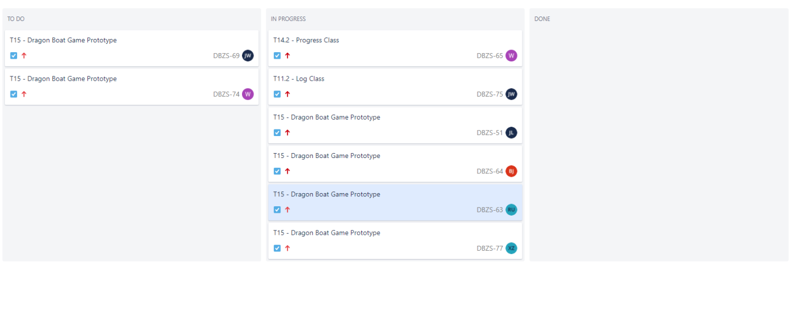

# Contents
- [About Us](#about-us)
- [Game Description](#game-description)
- [Assessment 1 Content](#assessment-1-content)
  - [Original Deliverables](#original-deliverables)
  - [Original Executables](#original-executables)
  - [Original Javadocs](#original-javadocs)
  - [Original Weekly Snapshots](#original-weekly-snapshots)
- [Assessment 2 Content](#assessment-2-content)
  - [Deliverables](#deliverables)
  - [Assessment 1 Edited Documents](#assessment-1-edited-documents)
  - [Executables](#executables)
  - [Javadocs](#javadocs)
  - [Weekly Snapshots](#weekly-snapshots)

# About Us

Ever wanted to race Dragon boats down the River Ouse? 
Of course, the answer is yes and we have just the game for you.
DragonBoat Z!

Our Team consists of:
*   Omar Omar
*   Rhianna Edwards
*   Okan Deniz
*   Omar Galvao Da Silva
*   Joel Wallis
*   Craig Smith

# Game Description

Dragon Boat Z is a single-player Boat Racing game based on the annual Dragon Boat Race held in York along the
River Ouse.

In Dragon Boat Z, the player competes against 6 AI opponents, racing their dragon boats across 3 legs to achieve the fastest time to cross the finish line.

Upon starting the game, The player can choose to start a new game or load a previous one.
When starting a new game, players can set the difficulty. After which, the player selects 1 of 7 boats as their boat that they would like to race with. 
Every boat has 4 statistics with each boat having a different distribution of these statistics.

## Boat Statistics
- <strong>Robustness</strong>
  - Determines how much damage a boat can take. 
  - A boat with higher robustness will lose a smaller percentage damage to the durability upon collision with an obstacle.
- <strong>Manoeuvrability</strong>
  - Determines how fast the boat can avoid obstacles. 
  - A boat with higher manoeuvrability will be able to move side to side better without losing speed.
- <strong>Max Speed</strong>
  - Determines how fast a boat can go. 
  - A boat with higher max speed will be able to go faster than other boats.
- <strong>Acceleration</strong>
  - Determines how quickly a boat can achieve its max speed. 
  - A boat with higher acceleration will achieve its max speed before other boats.

## Obstacles and Penalties
During the races, there are a series of obstacles that will be floating down the Ouse. The player must avoid these obstacles in order to not damage their boat.
If the boat's durability is reduced to 0 at any point within the game, the game ends and the player loses. So, watch out for those geese!!
Whilst navigating the obstacles, the player must make sure to stay in their lane to avoid incurring a time penalty.

## Powerups
During the races, Boats can pick up 5 different power ups. 
- <strong>Golden Feather</strong>
  - Makes the boats invincible for a limited time.
- <strong>Hammer</strong>
  - Repaires the boat.
- <strong>Speed Boost</strong>
  - Gives increased speed for a limited time.
- <strong>Move Boost</strong>
  - Increases the maneuvrability of the boat for a limited time.
- <strong>Watch</strong>
  - Decreases the lap time for the boat.

## Winning the Game
If the player manages to achieve one of the 3 fastest times across the 3 legs, they will qualify for the final race where they will compete against the other 2 fastest boats.
Upon completing the final race, the player will be awarded a medal, bronze, silver, or gold respective to their finishing position.

# Assessment 1 Content
### Original Deliverables
*   <a href="docs/deliverables/Req1.pdf">Requirements</a>
*   <a href="docs/deliverables/Arch1.pdf">Architecture</a>
*   <a href="docs/deliverables/Plan1.pdf">Method Selection and Planning</a>
*   <a href="docs/deliverables/Risk1.pdf">Risk Assessment and Mitigation</a>
*   <a href="docs/deliverables/Impl1.pdf">Implementation</a>

### Original Executables
*   <a href="https://github.com/TheWill10m/Dragon-Boat-Z/releases/download/v1.0/DragonBoat.jar">Dragon Boat Z Game</a>

### Original Javadocs
*   <a href="docs/javadoc/index.html">Javadocs HTML Export</a>

### Original Weekly Snapshots
#### Project Gantt Chart

#### Sprint Dropdowns

  
<strong> Sprint 1 - 08/10/2020 </strong>

Having completed the task of setting up Jira and other resources needed for the project, the focus was on preparatory 
work for the upcoming week. This involved adding to the existing set of Customer Questions constructed and develop an 
understanding of how GitHub Pages works. 

 
 
<a href="https://thewill10m.github.io/Dragon-Boat-Z/docs/sprints/Sprint%201.png">Sprint 1 Jira Board</a>
 

  

<strong> Sprint 2 - 15/10/2020 </strong>

Having completed the Customer meeting during the last Sprint, other tasks and deliverables could now be started. The priorities 
are the Architecture Abstract diagram that will be reviewed at the second meeting of this Sprint, as this will allow us to make decisions such as what game library would be used. Deliverables such as Method Selection and Planning, Requirements and Risk Assessment will be built up using the now known information from the Customer Meeting alongside the starting of Sprite Design. 

 
 
<a href="https://thewill10m.github.io/Dragon-Boat-Z/docs/sprints/Sprint%202.png">Sprint 2 Jira Board</a>
 

<strong> Sprint 3 - 22/10/2020 </strong>

Having completed the Abstract Architecture Diagram, a focus was put onto the Concrete Architecture Diagram development so 
it would be ready for when initial classes are constructed, based off the Gantt Chart. This also meant a decision
was made on the library used for this project: LibGDX. Thus, each team member was assigned the task of completing
the tutorial found in the documentation, of LibGDX, and further research. Continued deliverable work was assigned a low priority
as this was considered an iterative process throughout the course of the project. 

 
 
<a href="https://thewill10m.github.io/Dragon-Boat-Z/docs/sprints/Sprint%203.png">Sprint 3 Jira Board</a>
 

<strong> Sprint 4 - 29/10/2020 </strong>

 
In Sprint 3, the Concrete Architecture was created and allowed for critical tasks to begin: the initial classes. This
was a high priority as delays would impact the production of the prototype on time. Further deliverable work was 
assigned medium/low priority. To maintain a clear separation between work, the initial one board was separated into 
two: Deliverables and Implementation. It was decided that second session of the Sprint would focus on the progression
of these tasks and discuss if any would need to be reassigned. 

 
 
<strong> Deliverables Board </strong>

 
<a href="https://thewill10m.github.io/Dragon-Boat-Z/docs/sprints/Sprint%204%20-%20Deliverables.png">Sprint 4 Delievrables Jira Board</a>
 
<strong> Implementation Board </strong>

 
<a href="https://thewill10m.github.io/Dragon-Boat-Z/docs/sprints/Sprint%204%20-%20Implementation.png">Sprint 4 Implementation Jira Board</a>
 

 

 
  
<strong> Sprint 5 - 05/11/2020 </strong>

  
The backlog of tasks T14 and T11, from the previous Sprint, were assigned the highest priority, as continued programming work depended on their completion. With the aim of reaching the milestone M4, at the end of this Sprint, the prototype development was a high focus. The specific tasks related to the prototype were stated within the assignee's task description. Method Selection and Planning were a focus within the Deliverables board to continue to append changes that had occurred during the project lifecycle.

 
 
<strong> Deliverables Board </strong>

 
<a href="https://thewill10m.github.io/Dragon-Boat-Z/docs/sprints/Sprint_5_-_Deliverables.png">Sprint 5 Jira Deliverables Board</a>
 
<strong> Implementation Board </strong>

 
<a href="https://thewill10m.github.io/Dragon-Boat-Z/docs/sprints/Sprint_5_-_Implementation.png">Sprint 5 Jira Implementation Board</a>
 

<strong> Sprint 6 - 12/11/2020 </strong>

Due to some minor issues with the construction of the legs of the game in the prototype, this task was focused on. Once completed,
we envision that the final tasks to have a functioning game will be finished on time. There will be a high focus on the programming elements needed for the final product. During the second meeting of this sprint, if there is extra time to implement additional functionality of the game the task, Animations, will be attempted and potentially additional features. 
The Deliverables board focused on the finalising of the Implementation document, reflecting features that we have unsuccessfully 
managed to implement and any additional features we may include. 
 
 
<strong> Deliverables Board </strong>

 
<a href="https://thewill10m.github.io/Dragon-Boat-Z/docs/sprints/Sprint%206%20-%20Deliverables.png">Sprint 6 Jira Deliverables Board</a>
 
<strong> Implementation Board </strong>

 
<a href="https://thewill10m.github.io/Dragon-Boat-Z/docs/sprints/Sprint%206%20-%20Implementation.png">Sprint 6 Jira Implementation Board</a>
 

  
<strong> Sprint 7 - 19/11/2020 </strong>

  
Having reached the completion of the game, a focus on the game testing and peer review of finalised deliverables was
focused on. This was to ensure a successful completion of the entire project. 

 
 
<a href="https://thewill10m.github.io/Dragon-Boat-Z/docs/sprints/Sprint%207.png">Sprint 7 Jira Board</a>
 

# Assessment 2 Content
### Deliverables
*   <a href="#">Change Report</a>
*   <a href="#">Implementation</a>
*   <a href="#">Testing</a>
*   <a href="#">Continous Integration</a>
*   <a href="#">Self Assessment</a>
*   <a href=""docs/deliverables2/Manual.pdf"">Manual PDF</a>
*   <a href=""docs/deliverables2/Editiable Manual.docx"">Editable Manual</a>

### Assessment 1 Edited Documents
*   <a href="#">Requirements</a>
*   <a href="#">Architecture</a>
*   <a href="#">Method Selection and Planning</a>
*   <a href="#">Risk Assessment and Mitigation</a>
*   <a href="#">Implementation</a>

### Executables
*   <a href="#">Dragon Boat Z Game</a>

### Javadocs
*   <a href="#">Javadocs HTML Export</a>

### Weekly Snapshots
