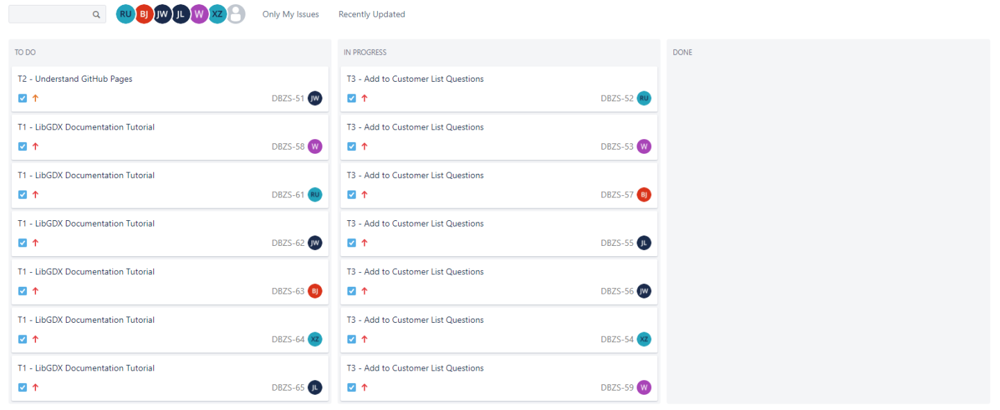
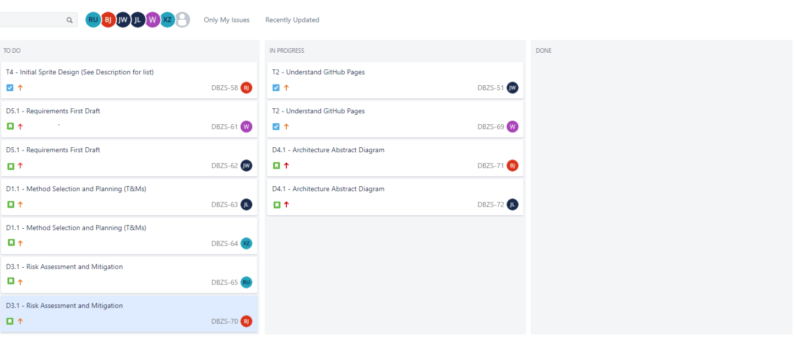
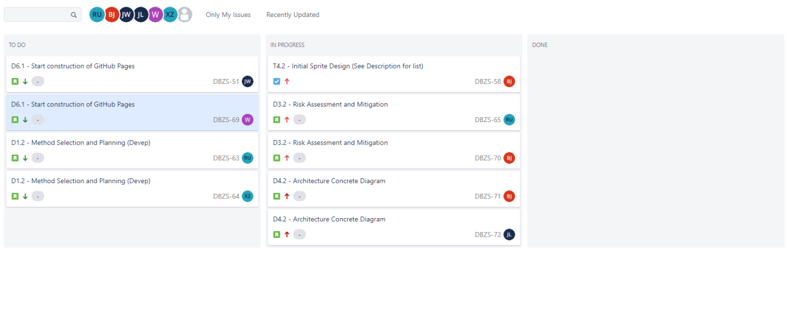
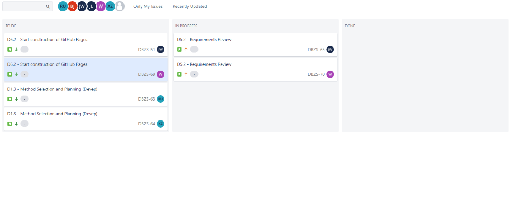
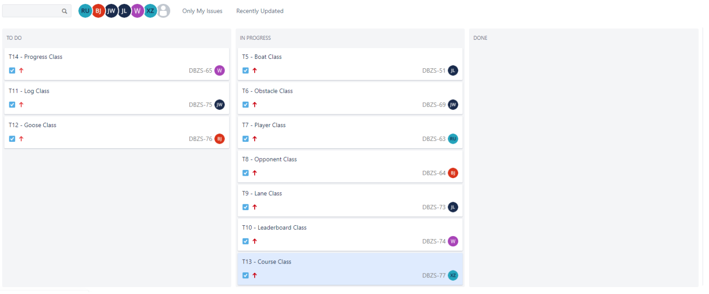
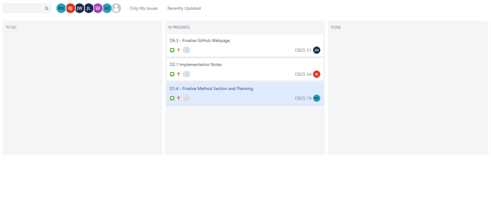
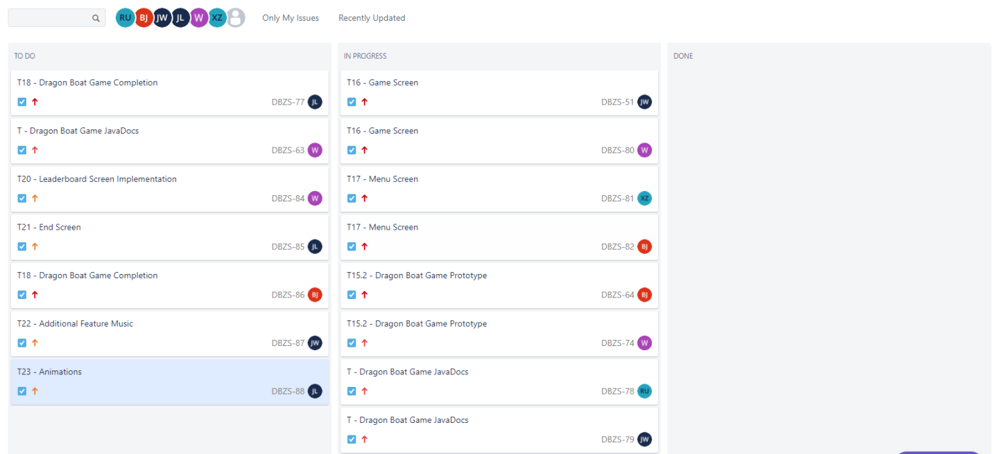
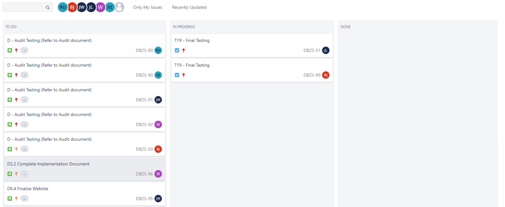

# About Us

Hey, we are Dragon Boat Z, and we have made a dragon boat racing game.
Here's our team:
*   Ben Jenner
*   James Wilkinson
*   Joe Lonsdale
*   Richard Upton
*   Will Dalgleish
*   Xinyi Zhang

# Assessment Content
### Deliverables
*   <a href="docs/Req1.pdf">Requirements</a>
*   <a href="docs/Arch1.pdf">Architecture</a>
*   <a href="docs/Plan1.pdf">Method Selection and Planning</a>
*   <a href="docs/Risk1.pdf">Risk Assessment and Mitigation</a>
*   <a href="docs/Impl1.pdf">Implementation</a>

### Executables
*   <a href="fileloaction.exe">Dragon Boat Z Game</a>

### Weekly Snapshots
*   Sprint 1 - 08/10/2020

*   Sprint 2 - 15/10/2020

*   Sprint 3 - 22/10/2020

*   Sprint 4 - 29/10/2020

*   Sprint 5 - 05/11/2020

*   Sprint 6 - 12/11/2020

*   Sprint 7 - 19/11/2020

# Game Description

Ever wanted to race dragon boats down the River Ouse? 
Of course the answer is yes and we have just the game for you.
DragonBoat Z!

In DragonBoat Z, the player competes against 6 AI opponents, racing their dragon boats across 3 legs to achieve the fastest time to cross the finish line.

Upon starting the game, the player selects 1 of 7 boats as their boat that they would like to race with.
Every boat has 4 statistics with each boat having a different distribution of these staistics.

## Boat Statistics
### Robustness
Determines how much damage a boat can take. A boat with higher robustness will lose a smaller percentage damage to the durability upon collision with an obstacle.
### Maneuverability
Determines how fast the boat can avoid obstacles. A boat with higher maneuverability will be able to move side to side better without losing speed.
### Max Speed
Determines how fast a boat can go. A boat with higher max speed will be able to go faster than other boats.
### Acceleration
Determines how quickly a boat can achieve its' max speed. A boat with higher acceeleration will achieve its max speed before other boats.

## Racing
During the races, there are a series of obstacles that will be floating down the Ouse. The player must avoid these obstacles in order to not damage their boat.
If the boat's durability is reduced to 0 at any point within the game, the game ends and the player loses. So watch out for those geeese!!
Whilst naivigating the obstacles, the player must make sure to stay in their lane to avoid incurring a time penalty.

If the player manages to achieve one of the 3 fastest times across the 3 legs, they will qualify for the final race where they will compete against the other 2 fastest boats.
Upon copmleting the final race, the player will be awarded a medal, bronze, silver, or gold respective to their finsihsing position.
